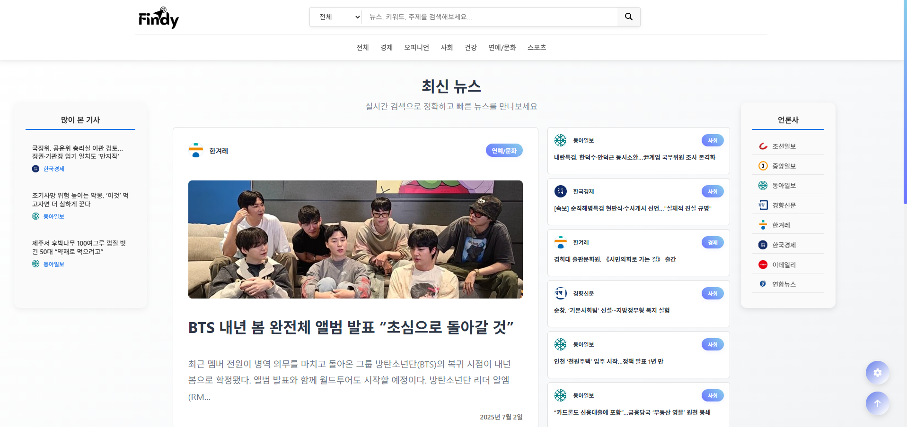
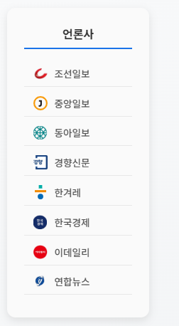

# 🕵️‍♂️ Findy: 뉴스 검색 엔진

 

**Findy**는 다양한 뉴스 플랫폼에서 수집한 기사 데이터를 기반으로, 
📡 실시간 수집 + 🧠 형태소 분석 + 🔍 고속 검색 + 📊 랭킹 정렬 기능을 제공하는 **뉴스 검색 엔진**입니다.


---

## 🌟 주요 기능 (기여도: 상: ⭐ / 중: ★ / 하: ☆)
> 기능별 개발 현황과 기여도를 함께 표시합니다.

| 기능명 | 설명 | 기여도 |
|--------|------|--------|
| **다크모드** | 뉴스 검색 화면에서 다크모드를 지원하여 사용자 편의성 향상 | 하 ☆ |
| **다국어 지원** | 메뉴 및 콘텐츠를 다국어로 설정 가능, 글로벌 사용자 편의성 제공 | 하 ☆ |
| **웹 크롤러 기반 뉴스 수집** | Python 로봇으로 뉴스 사이트에서 기사 주기적 수집 | 상 ⭐ |
| **뉴스 데이터 실시간 동기화** | 수집한 데이터 Monstache를 사용한 실시간 데이터 동기화 | 상 ⭐ |
| **형태소 분석 기반 키워드 처리** | Komoran, TF-IDF, TextRank, Nori로 키워드 추출 및 검색 | 상 ⭐ |
| **자동완성 기능** | 검색어 입력 시 실시간으로 관련 키워드 추천 | 상 ⭐ |
| **많이 본 기사 목록** | 사용자 열람 기준으로 인기 뉴스 목록 제공 (00:00 초기화) | 상 ⭐ |

⏳ *개발 예정 기능*

| 기능명 | 설명 | 진행 상황 |
|--------|------|-----------|
| **모바일지원** | 분석된 뉴스 데이터를 빠르게 검색할 수 있도록 색인 처리 | 중 ★ |
| **개인화 뉴스 추천** | 사용자 검색 이력을 바탕으로 맞춤형 뉴스 추천 제공 | 하 ☆ |
| **인기 키워드 트렌드 차트** | 현재 시점 기준 인기 키워드 시각화 | 중 ★ |


---

## 🛠 기술 스택

- 🎨 Frontend<br>
   

- 🔧 Backend<br>
  

- 🔍 수집 및 처리 <br>
   <details>
     <summary></summary>
     <pre>
       
       
       
       
       
       
     </pre>
   </details>

- 🧠 검색 및 분석 <br>
   

- 💾 데이터 저장소 <br>
    <br>

- ☁️ 실행 환경 (Infra)<br>
<br>
`Elasticsearch / MongoDB / MySQL 실행 환경 구성용`

- 🛠 개발 도구 & 빌드<br>
   


---

<details>
  <summary>📁 전체 프로젝트 구조</summary>
  <pre>
```
Findy-main/
├── 🖥️ Findy/                    # Spring Boot 백엔드
│   ├── src/main/java/com/boot/
│   │   ├── controller/          # REST API 컨트롤러
│   │   ├── service/            # 비즈니스 로직
│   │   ├── dto/                # 데이터 전송 객체
│   │   └── repository/         # MongoDB 레포지토리
│   └── src/main/resources/     # 설정 파일
├── 🎨 findy-frontend/           # React 프론트엔드
│   ├── src/components/         # React 컴포넌트
│   ├── src/styles/            # CSS 스타일
│   └── public/                # 정적 파일
├── 🕷️ findy-crawler/           # Python 크롤러
│   ├── crawlers/              # 언론사별 크롤러
│   ├── config/                # 설정 파일
│   └── utils/                 # 유틸리티 함수
└── 📚 docs/                    # 문서 파일
```
  </pre>
</details>


## MongoDB


## Elasticsearch


## 화면 설명

### 📰 당일 뉴스 랜덤 셀렉션 (메인 페이지) <br><br>
   <br><br>

   🔄 사용자에게 다양한 새로운 뉴스 제공!
   - 페이지를 새로 고침할 때마다 기사 조합이 바뀌어, 같은 뉴스 페이지라도 늘 새로운 첫인상을 경험할 수 있습니다.<br>
   - 수많은 기사중, 오늘 뉴스들로만 쏙쏙 골라주는 스마트한 메인입니다.<br><br><br>

### 🌙 다크모드 <br><br>
   <br><br>

   (눈관련 이모티콘 하나 추가?)사용자의 눈을 보호하고, 세련된 사용자 경험을 제공!<br>
   - 단순한 색상 반전이 아닌, 전체 UI 전반에 걸쳐 일관된 스타일과 분위기를 유지하로고 설계되었습니다.<br>
   - 로컬 스토리지(LocalStorage)를 통해 해당설정이 저장됩니다.<br><br><br>
   

### 🧭사이드 위젯기능 (좌/우 사이드) <br><br>
    <br><br>
  
   📈 왼쪽 사이드 - 실시간 TOP 5 뉴스!
      - 당일 뉴스중 가장 조회수가 높은 기사 5개를 실시간으로 집계해 보여줍니다.<br>
      - 매일 00:00 기준으로 초기화 되어, 새로운 하루의 인기 기사를 제공합니다.<br>
   🗞 오른쪽 사이드 - 언론사별 뉴스 보기!
      - Findy가 수집한 다양한 언론사 목록이 표시됩니다.<br>
      - 원하는 언론사를 클릭하면, 해당 언론사의 전체 뉴스 기사 목록이 화면에 출력됩니다.<br><br><br>

### 🗂️카테고리별 뉴스 <br><br>
   <br><br>

   🔍 검색어 입력 전, 카테고리 선택!
        - 검색어 입력 전 카테고리를 클릭하면, 해당 카테고리에 속한 뉴스 기사들만 선별하여 보여줍니다.<br>
        - 카테고리를 선택하고 검색어 입력하여 검색하면 해당 카테고리 안에서 검색이 가능합니다.<br><br><br>

### ✨실시간 자동완성 기능 <br><br>
   <br><br>

   💡 실시간 자동완성 추천!
         - 뉴스 수집시 추출괸 수천 개의 키워드가 자동완성의 기반이 되며, 입력한 문자열과 가장 유사한 키워드들을 우선 순위로 정렬하여 하단에 실시간으로 보여줍니다.
         - 검색어의 오타, 유사어, 부분 입력에도 대응할 수 있어, 사용자는 더 적은 입력으로 더 정확한 결과에 도달할 수 있습니다.

### 🤖AI 검색어 설명 기능 <br><br>
   <br><br>

   📚 내가 검색하는건 무엇일까!
         - 검색어를 검색하면 검색어 관련 뉴스 기사만 보여주는게 아니라 검색어가 뜻하는 바를 AI가 요약해서 사용자에게 먼저 보여줍니다.

### 📎뉴스 더보기 기능 <br><br>
   <br><br>

   🔽 자세하게 보기!
         - 사용자가 "뉴스 더보기" 버튼을 클릭하면 해당 기사를 더 자세하게 볼 수 있습니다.
